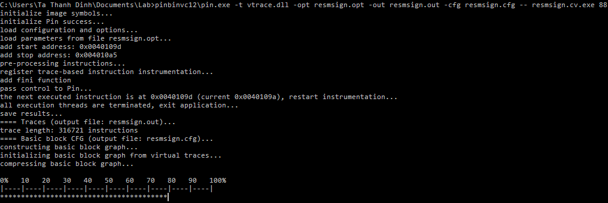

# relative-pattern
This is a tool experimenting a *formal method* for recovering program control flow graph from binaries obfuscated by
* [Tigress](http://tigress.cs.arizona.edu/)
* [VMProtect](http://vmpsoft.com/)
* [Code Virtualizer](http://oreans.com/)
* [O-LLVM](https://github.com/obfuscator-llvm/obfuscator)

The code is in active development and still difficult to use. The modules of the concolic execution engine are not published yet, though the current published code can work with any concolic or fuzzing engine. Currently there is no documentation (please contact me if you are interested in). I try also to prepare a paper on this but there are still a lot of things to do.

Though the approach is formal, seriously I think the main idea is not new. It is considered implicitly in many practical "unpack tutorials" of great hackers and crackers (while I am just a newbie). My original contribution here is only to give a more solid theoretical base that explains these concrete techniques, and this leads to a "less ad-hoc" deobfuscation technique.

The tool is written mostly in C++ and OCaml, and uses the following softwares:
* [BinSec](http://binsec.gforge.inria.fr)
* [ELFIO - ELF](https://github.com/serge1/ELFIO)
* [Type safe printf](https://github.com/c42f/tinyformat)
* [Pin](https://software.intel.com/en-us/articles/pin-a-dynamic-binary-instrumentation-tool)
* [Protocol Buffers](https://github.com/google/protobuf)
* [Boost](http://www.boost.org)

